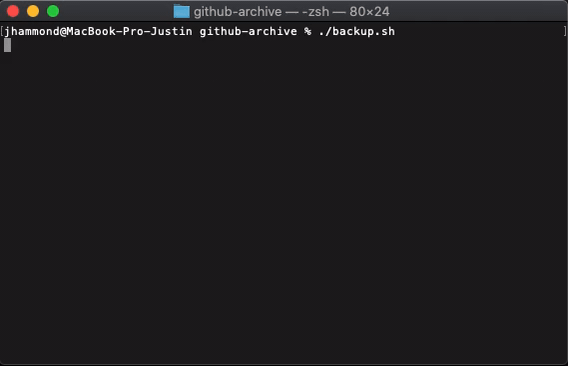

<div align="center">

# Github Archive

Clone your entire Github instance or save it to an archive.

[](https://travis-ci.org/Justintime50/github-archive)
[](https://opensource.org/licenses/mit-license.php)



</div>

## Install

This project requires that you have Python installed. Python comes built-in on macOS and Linux.

1. Run `cp .config.example .config` and edit the values to your liking.
1. For private repos, you must have an SSH key generated on your local machine and added to Github.

### Automating SSH Key Prompt (optional)

To allow the script to run continuosly without requiring your SSH passphrase, you'll need to add your passphrase to the SSH agent.

```bash
ssh-add -K ~/.ssh/id_rsa
```

## Usage

Github Archive will clone any repo that doesn't exist locally and pull those that do from the master branch of each repo that you have access to including organizations (if configured). You can run the script once or have it setup with a cron and run occasionally to clone/pull any changes since it was last run.

**Merge Conflicts:** *This is not intended to be used to pull repositories you also plan to work on from the `github-archive` location as you will receive merge conflicts. It is recommended to be used once on a new machine for example or setup as a separate archive from your development repositories.*

### Single Use
```bash
./backup.sh
```

### Cron Example
```bash
crontab -e

0 1 * * * ~/github-archive/backup.sh
```
