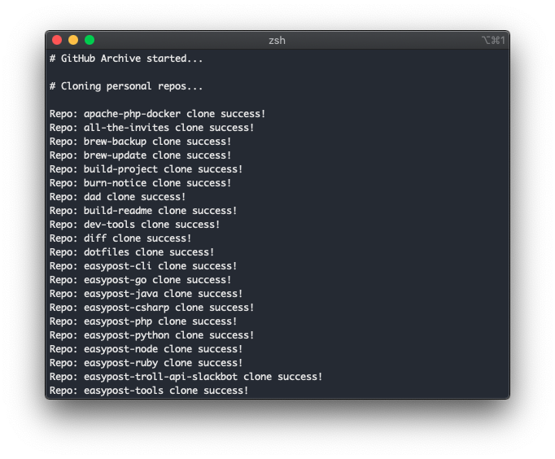

<div align="center">

# GitHub Archive

A powerful script to concurrently clone your entire GitHub instance or save it as an archive.

[](https://travis-ci.com/Justintime50/github-archive)
[](https://coveralls.io/github/Justintime50/github-archive?branch=master)
[](https://pypi.org/project/github-archive)
[](LICENSE)



</div>

GitHub Archive will clone any repo and gist that doesn't exist locally and pull those that do from your desired branch of each repo and latest revision of each gist that you have access to - including organizations (if configured).

## What Can it Do?

* Clone/pull personal repos (public and private)
* Clone/pull organization repos (public and private)
* Clone/pull personal gists (public and private)
* Iterate over infinite number of repos and gists concurrently
* Great use case: Run on a schedule to automate pulling changes or keep a local backup of all your repos

### Configurable Settings

The power of GitHub Archive comes in its configuration. Maybe you only want to clone/pull your personal public repos or maybe you want to go all out and include private repos from you and all organizations you belong to including your gists. Iterate over all your repos concurrently and sit back while GitHub Archive does the work.

* Personal repos cloning/pulling
* Organization repos cloning/pulling
* Gists cloning/pulling
* List of organizations to include
* Which branch to clone/pull from
* A host of environment variables to tweak GitHub Archive even further to meet your needs

## Install

```bash
# Install tool
pip3 install github-archive

# Install locally
make install

# Get Makefile help
make help
``` 

### Automating SSH Passphrase Prompt (Recommended)

To allow the script to run continuosly without requiring your SSH passphrase, you'll need to add your passphrase to the SSH agent. **NOTE:** Your SSH passphrase will be unloaded upon logout.

```bash
# This assumes you've saved your SSH keys to the default location
ssh-add
```

## Usage

**SSH Key:** You must have an SSH key generated on your local machine and added to your GitHub account as this tool uses the `ssh_url` to clone/pull. 

**Merge Conflicts:** Be aware that using GitHub Archive could lead to merge conflicts if you do not commit or stash your changes if using these repos as active development repos instead of simply an archive or one-time clone.

```
Basic Usage:
    GITHUB_TOKEN=123... github-archive --user-clone --user-pull

Advanced Usage:
    GITHUB_TOKEN=123... GITHUB_ARCHIVE_ORGS="org1, org2" GITHUB_ARCHIVE_LOCATION="~/custom_location" \
    github-archive -uc -up -gc -gp -oc -op -b develop

Options:
    -h, --help            show this help message and exit
    -uc, --user_clone     Clone personal repos.
    -up, --user_pull      Pull personal repos
    -gc, --gists_clone    Clone personal gists
    -gp, --gists_pull     Pull personal gists.
    -oc, --orgs_clone     Clone organization repos.
    -op, --orgs_pull      Pull organization repos.
    -b BRANCH, --branch BRANCH
                            Which branch to pull from. If no branch is specified, the default repo branch will be used.

Environment Variables:
    GITHUB_TOKEN                    expects a string of your GitHub Token
    GITHUB_ARCHIVE_ORGS             expects a string of comma separated orgs. eg: "org1, org2"
    GITHUB_ARCHIVE_LOCATION         expects a string of an explicit location on your machine (eg: "~/custom_location"). Default: ~/github-archive
    GITHUB_ARCHIVE_BUFFER           expects a float for the buffer inbetween requests. Default: 0.1
    GITHUB_ARCHIVE_TIMEOUT          expects an int for the number of seconds before a git operation times out. Default: 180
    GITHUB_ARCHIVE_LOG_MAX_BYTES    expects an int of the max bytes that a log will grow to. Once the log exceeds this number, it will rollover to another log. Default: 200000
    GITHUB_ARCHIVE_LOG_BACKUP_COUNT expects an int of the number of logs to rollover once a single log exceeds the max bytes size. Default: 5
```

## Development

```bash
# Lint the project
make lint

# Run tests
make test

# Run test coverage
make coverage

# Run the tool locally
venv/bin/python github_archive/cli.py --help
```

## Legacy Script

This tool was initially built in Bash and later re-written in Python. If you'd like to use or view the legacy script, check out the separate [Legacy README](legacy/README.md).
